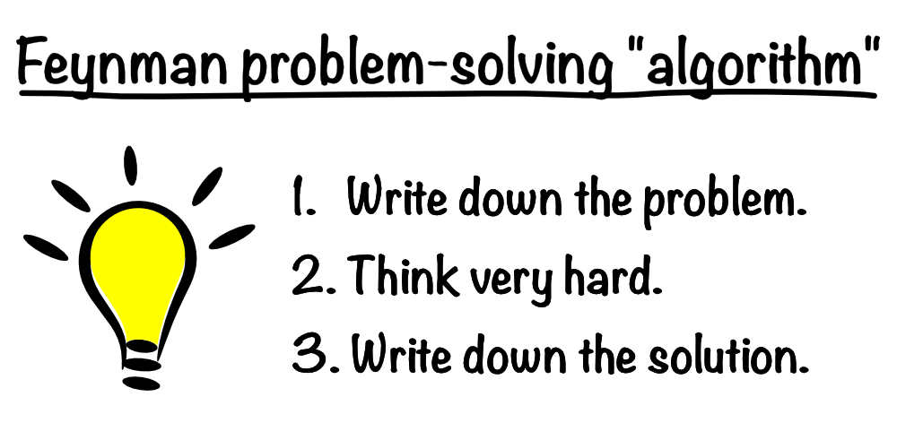

# Hilbert-Euler-Fibonacci Metaprogramming Contest 

The Hilbert-Euler-Fibonacci Metaprogramming Contest (HEF-MPC) is a 45 year late response to Hofstadter's "Gödel, Escher, Bach" (GEB)
published in 1979. 

HEF-MPC is based on an "upgrade" of metaphors or paradoxes of the giant trio of mathematics, namely 
Hilbert Hotel, Euler's Seven Bridges of Konigsberg and Fibonacci series:

- A. Euler's Konigsberg is now a "business park" in DMeta Decentralised Metaverse.
- B. Hilbert Hotel is located within Euler Business Park, with room number assigned using hash numbers.
- C. Fibonacci University, also located in Euler Business Park, conducts flipped classroom teaching by requiring students to submit assignments in the form of social media videos weekly or monthly, thereby recruiting new students in consistent with Fibonacci series.

HEF model attempts to answer (some of) the questions mentioned in GEB using metaprogramming, a term intended to describe abstraction of programming algorithms independent of programming languages.

HEF is one step ahead of Feynman's technique in the sense that problems and solutions shall be stated in metaprogramming scripts, in FORTH programming language or equivalent.

Why should anyone (Tom, Dick or Harry? Julia, Maria or Fatimah, to be politically correct) care about HEF?

In DMeta Decentralised Metaverse, everyone can own a piece of the Metaverse, and therefore IN REAL LIFE, gains REAL profits from the operations and transactions of DMeta Decentralised Metaverse.

IN REAL LIFE, the top 5 tech giants, collectively also known as MAGA (Microsoft, Meta, Amazon, Google, Apple) achieved total revenues exceeding USD 1.2 trillion in 2022. (2023 figures to be avialable soon.)

The Hash Number as the room number in Hilbert Hotel, holds the secret for users and free software programmers to claim royalties from social media giants for using their data and source code, where a mere 0.1% of only 5 tech companies amount to more than USD 1 billion per year!!

- Diagram Konigsberg with many bitcoins floating LOL

Now let us call this the final goal of DMeta Decentralised Metaverse:

- Step Z (Z of A...Z): Achieve 0.1% MAGA revenues (amount to more than USD 1 billion per year) by 2030!!

- Step A: DMeta Omnihash -- Start recruiting a DOWNLINES today with DMeta Omnihash
  - https://godmeta.github.io/h

- Step B: Recruit a total of 1000 DOWNLINES, and get investors to invest USD 1000, as the prize money for the First (EVER!!) Hilbert-Euler-Fibonacci Metaprogramming Contest.

- Step C: USD 1000 may be enought to attract 100 programmers to join DMeta, and start using DMeta Hash Contracts to mark their source code, with the following condition:
  - DMeta Hash Contract On the Separation of Disclosure and Royalties of the Source Code
    - You, a human agent of a company or government agency, may read the source code without making payments to the author or authors, but if you  execute this program on behalf of your company or agency for commercial purposes, we reserve the rights to claim royalties from you or your company or agency.

- Step D (2024Q1): 100 programmers on DMeta platform may be sufficient to produce the following apps:
  - A. DMeta Trispecies Loan
  - B. DMeta Anonymous Dating

These apps may generate sufficient revenues to pay a significant portion of allowances for DMeta programmers, say 20%.

- Step E (2024Q2): 1000 programmers on DMeta platforms, with the following apps, with 10000 users:-

Programmer income histogram ... 5 bands each 20% programmers ....

- A:
- B:
- C:
- D:
- E: